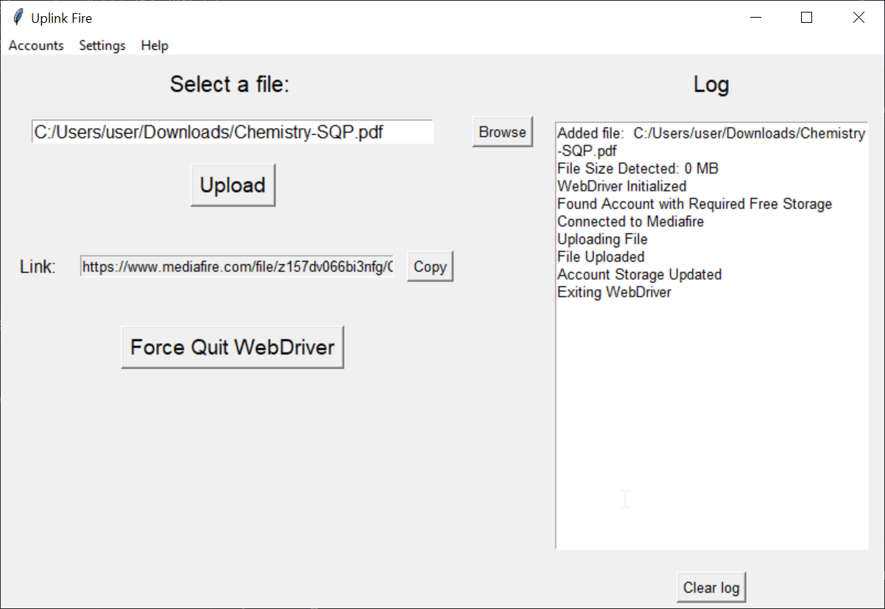
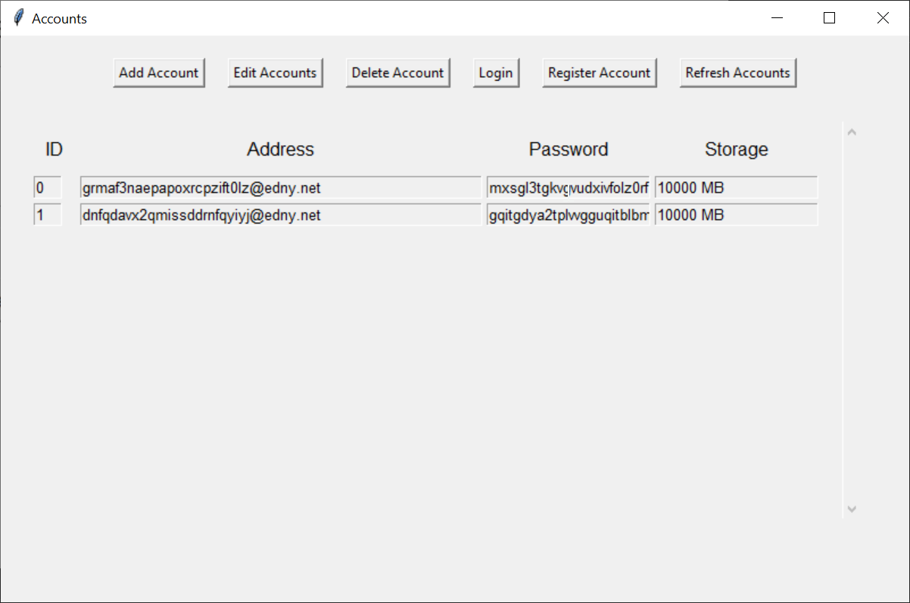

# Uplink Fire 🔥

Uplink Fire is a Python-based desktop application designed for fast, automated file uploads to MediaFire. It streamlines the upload process by managing MediaFire accounts, utilizing temporary email addresses for registration, and quickly generating shareable download links.

## ⭐ Features

* **Automated MediaFire Uploads:** Quickly upload files to MediaFire with minimal user interaction.
* **Temporary Email Registration:** Uses mailtm for fast account creation, bypassing the need for personal email addresses.
* **Account Management:** Stores and manages MediaFire account credentials (email, password, storage) within the application.
* **Fast Link Generation:** Automatically retrieves and copies the shareable MediaFire download link.
* **Detailed Logging:** Provides a log of all actions performed, including file uploads and account management.
* **GUI Interface:** User-friendly graphical interface for easy operation.
* **Webdriver Control:** Option to force quit the WebDriver.
* **Timing controls:** Controls for wait duration, upload duration and captcha duration.

## 📋 Prerequisites

   * Python 3.13 or higher
   * pip (Python package installer)

## ⚙️ Installation

1.  **Clone the Repository:**
    ```bash
    git clone https://github.com/Krishot7/MediaFire-Upload-Automation-Tool-UplinkFire.git
    cd MediaFire-Upload-Automation-Tool-UplinkFire
    ```
3.  **Setup venv**

    For Windows
    ```bash
    # Create new python virtual environment
    python -m venv .venv
    
    # Activate the virtual environment
    .venv\Scripts\activate
    ```
    For Linux/MacOS
    ```bash
    # Create new python virtual environment
    python -m venv .venv
    
    # Activate the virtual environment
    source .venv/bin/activate
    ```
5.  **Install Dependencies:**
    ```bash
    pip install -r requirements.txt
    ```
6.  **Configure WebDriver:**
    * Download the appropriate Chrome WebDriver for your chrome version in case the provided executable is outdated.
    * Replace the Chrome WebDriver executable in the `UplinkFire` folder.
    * Make sure to rename it to `chromedriver.exe` in case it has a different name.
7.  **Run the Application:**
    ```bash
    cd UplinkFire
    python uplinkfire.py
    ```

## ⚽ Usage

1.  **Account Management:**
    * Use the "Accounts" menu to manage MediaFire accounts.
    * Add, edit, delete, and log in to accounts.
    * Register new accounts using temporary email addresses.
2.  **File Upload:**
    * Select a file using the "Browse" button.
    * Click the "Upload" button.
    * The shareable link will be displayed in the "Link" field and copied to your clipboard.
    * **Important:** Wait for the upload to complete before changing the active window.
3.  **Logging:**
    * The "Log" panel displays a history of actions.
    * Clear the log with the "Clear Log" button.
4.  **Webdriver Control:**
    * "Force Quit Webdriver" will close the webdriver.
5.  **Timing Controls:**
    * **Wait Duration:** Adjust the maximum time the WebDriver waits for components. Only increase if you have a slow internet connection.
    * **Upload Duration:** Adjust the maximum time allotted for file uploading. Files exceeding this time will be interrupted.
    * **Captcha Duration:** Adjust the maximum time given for filling the reCAPTCHA during registration.

## 🕷 Troubleshooting

* **WebDriver Issues:**
    * If the WebDriver is not working correctly, download the latest stable version of `chromedriver.exe` from [https://googlechromelabs.github.io/chrome-for-testing/](https://googlechromelabs.github.io/chrome-for-testing/) and replace the existing one in the `UplinkFire` folder (or the `_internal` folder for the pre-built release).
    * Ensure the file is named `chromedriver.exe`.
* **Account Registration:**
    * If a reCAPTCHA appears, the automatic registration will halt. Manually complete the reCAPTCHA and click "Submit."
    
* **Account Suspension**
  * If an account has been inactive for a long time, it will get suspended.
  * It is adviced to delete suspended accounts from the Accounts list
  * To prevent account suspension, log into each account at least once a year.

## 🚫 Limitations

* Files bigger than 10 GB can not be uploaded.

## 🖼 Screenshots


(obviously, the passwords are not real)

## ❤ Contributing

Contributions are welcome! Please feel free to submit pull requests or open issues.

## 💲 License

This project is licensed under the MIT License.

## ❗ Dependencies

* Selenium
* MailTM
* Pyperclip

## ⏳ Future Enhancements

* Better documentation
* Option to upload files into a particular account
* Option to upload files in bulk
* Option to download files

## 🖋 Author

[@Krishot7](https://github.com/Krishot7)
